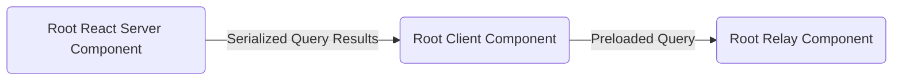

# Simple Issue Tracker Example (with Next.js 13)

## Overview

This is a simplified example of the [Issue Tracker Example](https://github.com/relayjs/relay-examples/tree/main/issue-tracker). But with few updates:

- Uses the React Server Components (Next.js v13) as entry points for [fetching](https://beta.nextjs.org/docs/data-fetching/fetching) root queries.

  - `loadSerializableQuery` reference implementation of the data-fetching method that can be used in the RSC
  - `useSerializablePreloadedQuery` an example hook that can convert serialized query results into preloaded query.

- Has TypesScript Setup.

## Workflow

The query fetching is happening in the `page.tsx` async server component that is calling `loadSerializableQuery`. Then, preloaded results are passed to the root client component (`MainViewClientComponent`, for example). These preloaded results are converted into Relay's `PreloadedQuery` object, which is passed to the root Relay component that renders the query with the `usePreloadedQuery` hook.

## Installation

For installation instructions, please follow [this steps](https://github.com/relayjs/relay-examples/tree/main/issue-tracker#setup) from the `issue-tracker` example.
